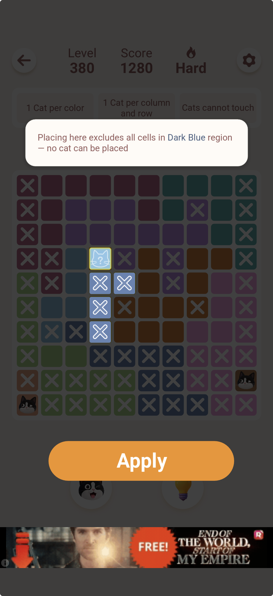
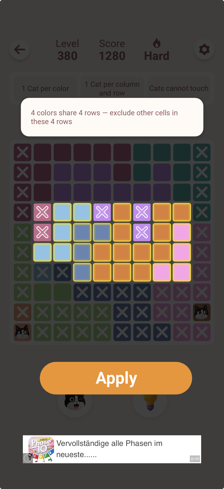
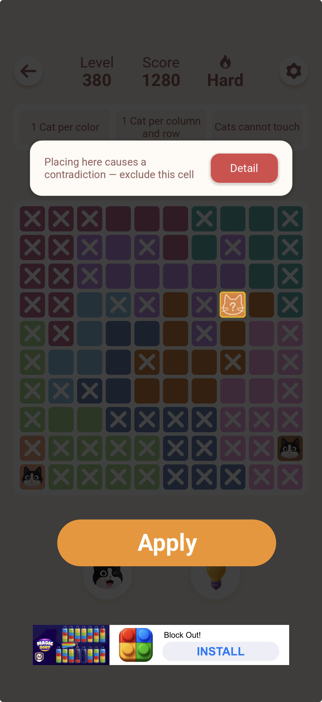
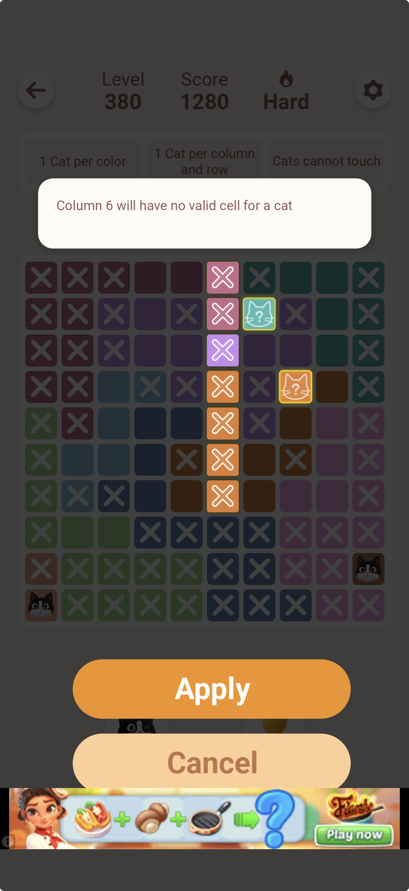
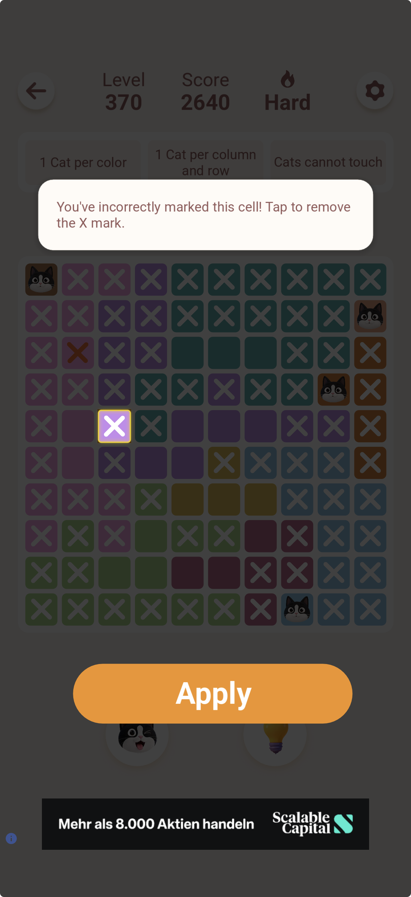

# Coaching System

**Status:** Done (Session 4 — 2026-06-23), tactic engine expanded (Session 5 — 2026-06-23), rewritten as named lessons + batched What-If + reverse/hidden/generalized techniques + checked-trail (Session 6)

See `docs/architecture.md` for full design rationale and lessons learned.

---

## Hint button

Silent step-through. Each press reveals the next unplaced cat on the grid in row order — no text, no explanation, no Apply/Cancel. For users who just want to move forward without thinking about rules.

`runHint()` in `app.js` — finds the lowest-numbered unplaced row, calls `revealedRows.add(r)`, done.

---

## Explain button

Progressive coaching. Each press runs the tactic engine against the current board state and returns one lesson, taught the same way every time — **Name** (the technique) → **Rule** (the general principle) → **Here** (how it applies right now):

- A dimmed, struck-through **checked trail** above the name — e.g. "Checked first, no luck: Last Spot → Line Lock → Crowding" — showing which simpler techniques were tried and found nothing, so the player learns the checking order, not just the answer
- Bold technique name with emoji (🎯 Last Spot, 📏 Line Lock, 👥 Crowding, 🤏 Shared Shadow, 🤔 What-If)
- The general rule, in plain language — this is the part meant to transfer to the next puzzle
- The specific application to the current board, coordinates last
- Visual cell highlights (gold pulse = target cat, amber glow = region candidates, red border = cells being crossed out)
- **Apply** button — executes the deduction (places the cat or writes X marks)
- **Cancel** button — dismisses without changing the board

Pressing Explain again after Apply or Cancel gives the next lesson on the updated board. The chain continues until the puzzle is solved.

### State used by Explain

| Field | Type | Purpose |
|---|---|---|
| `state.revealedRows` | `Set<number>` | Rows whose cats are visible |
| `state.xMarks` | `boolean[row][col]` | X-marked cells (imported + user-applied via Apply) |
| `state.hintCells` | `[{row,col,role}]` | Cells highlighted by the active deduction |
| `state.pendingAction` | `object \| null` | What Apply will execute |
| `state.importedCats` | `[{row,col}]` | Cats detected from screenshot (always shown) |

### Tactic engine (`generateHintText` in `app.js`)

Scans board state and returns the simplest applicable deduction as `{name, rule, here, cells, action, checked}`. Tactics fire in **human-difficulty order** — simplest first, What-If last — and each block records itself in a `checked` trail (via `noteChecked()`) if its full scan finds nothing, so the returned hint can show what was tried before it. Several tactics share one displayed name because they're the same *technique* applied to different shapes or directions — deliberate, so the player recognizes "this is a Crowding" regardless of which form it took.

| Technique | Covers | What it detects | Action |
|---|---|---|---|
| 🎯 **Last Spot** | region / row / column | Down to exactly 1 valid cell | Place cat |
| 📏 **Line Lock** (forward) | row, column | All of a color's valid cells fall in one line → cross that color's other cells AND other colors' cells on that line | X marks |
| 📏 **Line Lock** (reverse) | row, column | All of a *line's* valid cells are one color → that color's cat is in this line → cross that color out everywhere else, even where it still has other candidates | X marks |
| 👥 **Crowding** (naked) | rows K=2..4, cols K=2..4 | K colors confined to the same K lines → cross other colors out of those lines (generalizes "naked pair") | X marks |
| 👥 **Crowding** (hidden) | rows K=2..4, cols K=2..4 | K lines can only be reached by K colors combined (dual of naked Crowding — "hidden pair/triple/quad") → those colors must place inside those lines → cross their other cells out everywhere else | X marks |
| 🤏 **Shared Shadow** | any region / row / column, any candidate count ≥ 2 | Every remaining candidate of a unit would eliminate some other cell (via shared row, column, color, or king-move touch) → that cell is dead regardless of which candidate wins. Generalizes the old fixed-shape "line segment / diagonal pinch / conjugate pair" tactics — same idea, no cap on candidate count, and reasons about shared row/col/color too, not just touch | X marks |
| 🤔 **What-If** | any open cell, batched | Hypothesize a cat, propagate every forced follow-up; if the chain empties a row/column/region, that cell is impossible. **Every open cell on the board is tested in one pass** and every dead end found is crossed out together — not one Explain-press per cell | X marks |
| 🧩 **Beyond the Rules** (fallback) | — | No technique resolved it → solver answer with honest disclaimer | Place cat |

`isValid(r, c)` checks: row unplaced · cell colored · column unused · color unused · not X-marked · no king-move clash.

**Why What-If is batched:** early-game positions can have dozens of individually-impossible cells (see `docs/sessions/` Session 6 — a Hard level 840 needed 42 separate contradiction eliminations under the old one-cell-per-press design). Testing every open cell against the *same* board snapshot in one pass is sound — the tests don't depend on each other — so they're combined into a single Apply.

**Why the reverse/hidden/generalized techniques were added:** even with batching, that same Hard level 840 still leaned on What-If for 69 cells across 3 big batches — a sign that *explainable* human techniques were missing, not that the puzzle genuinely needed brute-force contradiction testing. Adding Line Lock (reverse), Crowding (hidden), and generalizing Squeeze into Shared Shadow (any candidate count, not just 2–3) dropped that to a **single 29-cell What-If batch**, with the rest of the puzzle (28 of 29 steps) resolved by nameable, teachable logic. Verified via a live run of the actual `app.js` engine (not a mirror) plus a 75-random-puzzle regression (sizes 5–10): 100% solved, zero unsound eliminations.

**Why Shared Shadow subsumes the old Squeeze:** the general test — "does every remaining candidate of this unit eliminate cell X, via shared row, column, color, or king-move touch?" — covers the old line-segment/diagonal-pinch/conjugate-pair special cases (which only checked king-move touch, capped at 2–3 candidates) as special cases, and finds strictly more: it works for any candidate count and also catches eliminations via shared row/column/color, not just physical touch.

### Reference: original Meowdoku app

These screenshots show the original app's Explain-equivalent — the design we're matching.

| Screenshot | Rule shown |
|---|---|
|  | "Placing here excludes all cells in Dark Blue region — no cat can be placed" |
|  | "4 colors share 4 rows — exclude other cells in these 4 rows" |
|  | "Placing here causes a contradiction — exclude this cell" |
|  | "Column 6 will have no valid cell for a cat" |
|  | "You've incorrectly marked this cell! Tap to remove the X mark" |

Key principle from the original: text is always a **reason** (why), never just a destination (where).

`docs/assets/our-explain-fallback-example.png` shows the old state before the tactic engine was built — "Place the Red 10 cat at row 1, col 7." with no reasoning. The tactic engine now handles all the cases shown above; the fallback only fires when none of them apply.

---

## Key files

- `app.js` — `generateHintText()`, `runHint()`, `runExplain()`, `runApply()`, `showHint()`, `clearHint()`
- `style.css` — `.hint-box`, `.hint-actions`, `.btn-apply`, `@keyframes hintpulse`, `.cell.hint-cat/region/locked`
- `index.html` — `#hint-box`, `#hint-actions`, `#apply-btn`, `#cancel-btn`, `#hint-btn`, `#explain-btn`

---

## Future work

- **Explain progress indicator** — show how many deductions remain / solve progress
- **Undo** — un-apply an Explain step; Ctrl+Z on desktop, gesture on mobile
