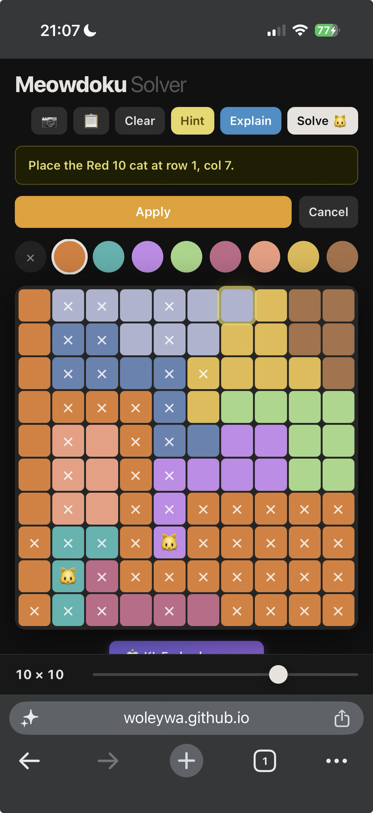

# Hint / Explain System

**Status:** Done (Session 4 — 2026-06-23)

See `docs/architecture.md` for full design rationale and lessons learned.

---

## Reference: original Meowdoku app

These screenshots show what the original app's hint system looks like — the design we're aiming to match or improve on.

| Screenshot | What it shows |
|---|---|
|  | "Placing here excludes all cells in Dark Blue region — no cat can be placed" |
|  | "4 colors share 4 rows — exclude other cells in these 4 rows" |
|  | "Placing here causes a contradiction — exclude this cell" |
|  | "Column 6 will have no valid cell for a cat" |
|  | "You've incorrectly marked this cell! Tap to remove the X mark" |

Key observations from the original:
- Text is always a **reason** (why), not a destination (where)
- Highlights show the *affected cells*, not just the target
- "Placing here causes a contradiction" = forward-checking: the original tests placements and detects knock-on rule violations
- "Column 6 will have no valid cell" = the original reasons about *columns* losing all candidates, not just rows/regions

**Current state of our Explain (known gap):**

"Place the Red 10 cat at row 1, col 7." — this is the fallback firing. It tells the user *what* to do with no *why*. This is the main quality gap to fix.

---

## Two buttons, two jobs

**Hint** — silent step-through. Reveals the next cat on the grid without any explanation. For users who just want to move forward.

**Explain** — progressive coaching. Each press produces one logical deduction:
- One-sentence explanation of the rule that applies
- Visual cell highlights on the grid (gold pulse = target cat, amber glow = region cells, red border = locked-out cells)
- **Apply** button to execute the deduction
- **Cancel** button to dismiss without applying

Pressing Explain again (after Apply or Cancel) gives the next deduction for the updated board state. The chain continues until the puzzle is solved.

---

## State

| Field | Type | Purpose |
|---|---|---|
| `state.revealedRows` | `Set<number>` | Rows whose cats are currently visible |
| `state.xMarks` | `boolean[row][col]` | X-marked cells (imported + user-applied) |
| `state.hintCells` | `[{row,col,role}]` | Cells highlighted by active hint |
| `state.pendingAction` | `object \| null` | What Apply will execute |
| `state.importedCats` | `[{row,col}]` | Cats detected from screenshot (always shown) |

---

## Tactic detection (`generateHintText`)

Scans the current board state and returns the simplest applicable deduction. Returns `{text, cells, action}`.

Priority order:

1. **Forced region** — one valid cell left in a color region → `action: {type:'cat', row, col}`
2. **Forced row** — one valid column left in a row → `action: {type:'cat', row, col}`
3. **Region confined to one row** — all valid region cells in same row → `action: {type:'xmarks', cells: regionCells outside that row}`
4. **Region confined to one column** — same, vertically → `action: {type:'xmarks', cells: regionCells outside that col}`
5. **Naked pair** — two colors locked to same two rows → `action: {type:'xmarks', cells: other-color cells in those rows}`
6. **Fallback** — no rule found → suggest next solution step → `action: {type:'cat', row, col}`

`isValid(r, c)` checks: row not placed, cell colored, column unused, color unused, cell not X-marked, no adjacency conflict.

---

## Key files

- `app.js` — `generateHintText()`, `runHint()`, `runExplain()`, `runApply()`, `showHint()`, `clearHint()`
- `style.css` — `.hint-box`, `.hint-actions`, `.btn-apply`, `@keyframes hintpulse`, `.cell.hint-cat/region/locked`
- `index.html` — `#hint-box`, `#hint-actions`, `#apply-btn`, `#cancel-btn`, `#hint-btn`, `#explain-btn`

---

## Future work

- **Naked pair for columns** — currently only rows; add column version
- **Progress indicator** — show how many deductions remain / how far along the solve is
- **Undo** — let the user un-apply a step
